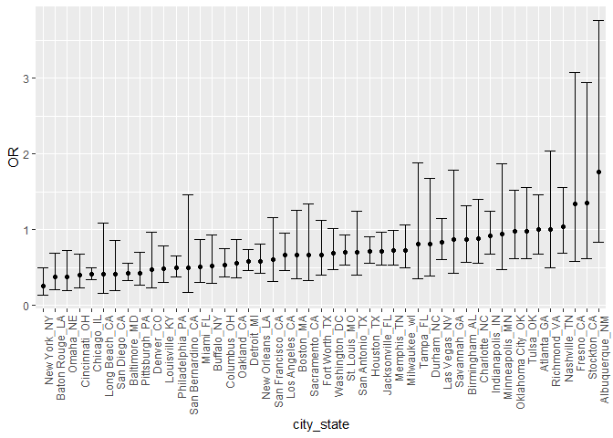
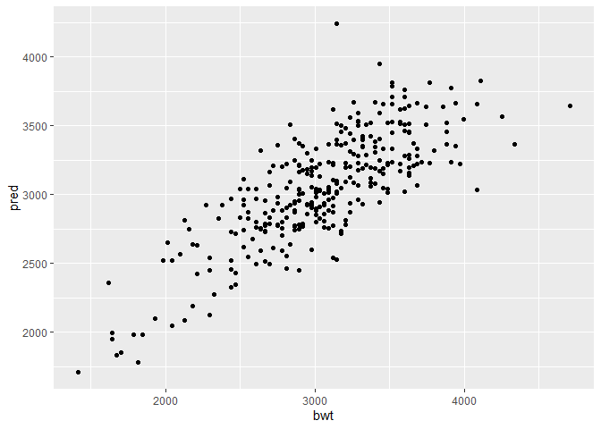
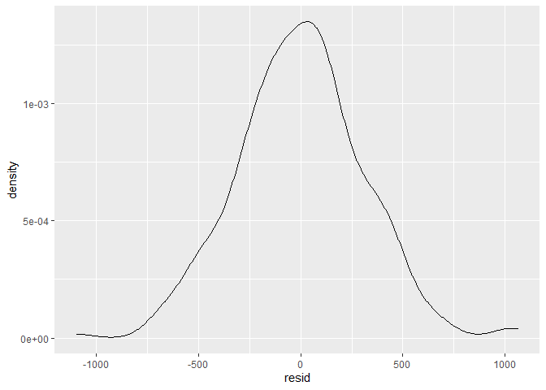
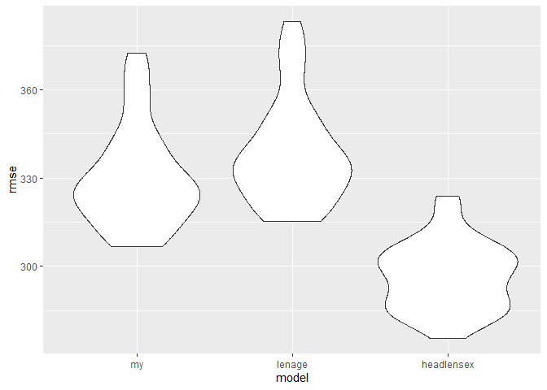

Amanda Nagle
11/24/2020

## Problem 1

``` r
homicide_df = 
  read_csv("homicide-data.csv", na = c("", "NA", "Unknown")) %>%
  mutate( city_state = str_c(city, state, sep = "_"),
          victim_age = as.numeric(victim_age),
    resolved = case_when(
      disposition == "Closed without arrest" ~ 0,
      disposition == "Open/No arrest" ~ 0,
      disposition == "Closed by arrest" ~ 1,
    )) %>%
  filter(city_state != "Tulsa_AL") %>%
  filter(victim_race %in% c("White", "Black")) %>%
  select(city_state, resolved, victim_age, victim_race, victim_sex)
```

``` r
baltimore_df = homicide_df %>%
  filter(city_state == "Baltimore_MD")

glm(resolved ~ victim_age + victim_race + victim_sex, 
    data= baltimore_df,
    family = binomial()) %>%
broom::tidy() %>%
  mutate(
    OR = exp(estimate),
    CI_lower = exp(estimate - 1.96 * std.error),
    CI_upper = exp(estimate + 1.96 * std.error)
  ) %>%
  select(term, OR, starts_with("CI")) %>%
  knitr::kable(digits = 3)
```

| term              |    OR | CI\_lower | CI\_upper |
| :---------------- | ----: | --------: | --------: |
| (Intercept)       | 1.363 |     0.975 |     1.907 |
| victim\_age       | 0.993 |     0.987 |     1.000 |
| victim\_raceWhite | 2.320 |     1.648 |     3.268 |
| victim\_sexMale   | 0.426 |     0.325 |     0.558 |

applying model to all cities:

``` r
model_results_df = homicide_df %>%
  nest(data = -city_state) %>%
  mutate(
    models = map(.x = data, ~glm(resolved ~ victim_age + victim_race + victim_sex, data= .x, family = binomial())), 
    results = map(models, broom::tidy)
  ) %>%
  select(city_state, results) %>%
  unnest(results) %>%
  mutate(
    OR = exp(estimate),
    CI_lower = exp(estimate - 1.96 * std.error),
    CI_upper = exp(estimate + 1.96 * std.error)
  )

model_results_df %>%
  filter(term == "victim_sexMale") %>%
  mutate(city_state = fct_reorder(city_state, OR)) %>%
  ggplot(aes(x = city_state, y = OR)) +
  geom_point() +
  geom_errorbar(aes(ymin = CI_lower, ymax = CI_upper)) +
  theme(axis.text.x = element_text(angle = 90, hjust = 1))
```

<!-- -->

## Problem 2

``` r
birthweight_df = 
  read_csv("birthweight.csv", na = c("", "NA", "Unknown")) %>%
  mutate(babysex = as.factor(babysex), mrace = as.factor(mrace))
```

I am doing my capstone on how structural stigma impacts maternal health.
The research review for that project led me to read a lot of articles on
low birth weight births and factors that contribute to it.

My first thought was to include babies length, gestational age, mothers
race (minority stress has been shown to impact birth weight),
malformations, previous number of low weight births, and cigarettes
smoked in my model. However, malformations and previous number of low
weight babies did not have wnough variation.

``` r
train_df = sample_n(birthweight_df, 320)
test_df = anti_join(birthweight_df, train_df)
```

    ## Joining, by = c("babysex", "bhead", "blength", "bwt", "delwt", "fincome", "frace", "gaweeks", "malform", "menarche", "mheight", "momage", "mrace", "parity", "pnumlbw", "pnumsga", "ppbmi", "ppwt", "smoken", "wtgain")

``` r
my_mod = lm(bwt ~ blength + mrace + gaweeks + smoken, data = train_df)

rmse(my_mod, train_df)
```

    ## [1] 298.3575

``` r
train_df %>% 
  add_predictions(my_mod) %>%
  add_residuals(my_mod) %>%
  ggplot(aes(x=bwt, y=pred)) +
  geom_point()
```

<!-- -->

``` r
train_df %>% 
  add_predictions(my_mod) %>%
  add_residuals(my_mod) %>%
  ggplot(aes(x=resid)) +
  geom_density()
```

<!-- --> The
residuals look good.

Other models:

``` r
lenage_mod = lm(bwt ~ blength + gaweeks, data = train_df)
lensexhead_mod = lm(bwt ~ bhead*blength*babysex + bhead*blength + bhead*babysex + blength*babysex, data= train_df)

train_df %>% 
  gather_predictions(my_mod, lenage_mod, lensexhead_mod) %>%
  gather_residuals(my_mod, lenage_mod, lensexhead_mod)
```

    ## # A tibble: 2,880 x 23
    ##    model babysex bhead blength   bwt delwt fincome frace gaweeks malform
    ##    <chr> <fct>   <dbl>   <dbl> <dbl> <dbl>   <dbl> <dbl>   <dbl>   <dbl>
    ##  1 my_m~ 1          35      49  3090   157      25     2    39.4       0
    ##  2 my_m~ 1          35      52  3799   147      15     2    44.3       0
    ##  3 my_m~ 2          32      49  2863   150      55     2    36.9       0
    ##  4 my_m~ 1          34      51  2892   147      45     2    38.9       0
    ##  5 my_m~ 1          35      51  3544   142      55     1    39.7       0
    ##  6 my_m~ 2          33      52  3062   185      45     2    40         0
    ##  7 my_m~ 1          34      52  2863   138      35     4    39.9       0
    ##  8 my_m~ 1          33      50  3260   155      25     2    35.9       0
    ##  9 my_m~ 1          36      54  3997   132      65     1    42         0
    ## 10 my_m~ 1          34      53  3629   154      75     1    39.3       0
    ## # ... with 2,870 more rows, and 13 more variables: menarche <dbl>,
    ## #   mheight <dbl>, momage <dbl>, mrace <fct>, parity <dbl>, pnumlbw <dbl>,
    ## #   pnumsga <dbl>, ppbmi <dbl>, ppwt <dbl>, smoken <dbl>, wtgain <dbl>,
    ## #   pred <dbl>, resid <dbl>

``` r
cv_df = 
  crossv_mc(birthweight_df, 50) %>%
  mutate(
    train = map(train, as_tibble),
    test = map(test, as_tibble)) %>%
   mutate(
    my_mod  = map(train, ~lm(bwt ~ blength + mrace + gaweeks + smoken, data = train_df)),
    lenage_mod  = map(train, ~lm(bwt ~ blength + gaweeks, data = train_df)),
    headlensex_mod  = map(train, ~lm(bwt ~ bhead*blength*babysex + bhead*blength + bhead*babysex + blength*babysex, data= train_df))) %>% 
  mutate(
    rmse_my = map2_dbl(my_mod, test, ~rmse(model = .x, data = .y)),
    rmse_lenage = map2_dbl(lenage_mod, test, ~rmse(model = .x, data = .y)),
    rmse_headlensex = map2_dbl(headlensex_mod, test, ~rmse(model = .x, data = .y)))
  
cv_df %>% 
  select(starts_with("rmse")) %>% 
  pivot_longer(
    everything(),
    names_to = "model", 
    values_to = "rmse",
    names_prefix = "rmse_") %>% 
  mutate(model = fct_inorder(model)) %>% 
  ggplot(aes(x = model, y = rmse)) + geom_violin()
```

<!-- --> I am
surprised that the model including sex was so much better than the other
too. Conceptually, it didn’t seem like a meaningful predictor to me.
Perhaps it is the head circumference too. Maybe it is a good predictor
of physical development

## Problem 3

``` r
weather_df = 
  rnoaa::meteo_pull_monitors(
    c("USW00094728"),
    var = c("PRCP", "TMIN", "TMAX"), 
    date_min = "2017-01-01",
    date_max = "2017-12-31") %>%
  mutate(
    name = recode(id, USW00094728 = "CentralPark_NY"),
    tmin = tmin / 10,
    tmax = tmax / 10) %>%
  select(name, id, everything())
```

    ## Registered S3 method overwritten by 'hoardr':
    ##   method           from
    ##   print.cache_info httr

    ## using cached file: C:\Users\amand\AppData\Local\Cache/R/noaa_ghcnd/USW00094728.dly

    ## date created (size, mb): 2020-10-03 20:55:33 (7.537)

    ## file min/max dates: 1869-01-01 / 2020-10-31

``` r
weather_bootstrap_results = weather_df %>% 
  modelr::bootstrap(n = 5000) %>% 
  mutate(
    models = map(strap, ~lm(tmax ~ tmin, data = .x) ),
    results = map(models, broom::tidy),
    r2 = map2_dbl(models, strap, ~rmse(model = .x, data = .y)))%>%
  select(-strap, -models) %>% 
  unnest(results) %>% 
  pivot_wider(names_from = term, values_from = estimate:r2) %>% 
  janitor::clean_names() %>%
  mutate(calc = log(estimate_intercept * estimate_tmin)) %>%
  summarize(
    r2_ci_lower = quantile(r2_tmin, 0.025), 
    r2_ci_upper = quantile(r2_tmin, 0.975),
    calc_ci_lower = quantile(calc, 0.025), 
    calc_ci_upper = quantile(calc, 0.975)) 

weather_bootstrap_results %>% knitr::kable()
```

| r2\_ci\_lower | r2\_ci\_upper | calc\_ci\_lower | calc\_ci\_upper |
| ------------: | ------------: | --------------: | --------------: |
|      2.707497 |      3.141044 |        1.964994 |         2.05836 |

``` r
colnames(weather_bootstrap_results)
```

    ## [1] "r2_ci_lower"   "r2_ci_upper"   "calc_ci_lower" "calc_ci_upper"
